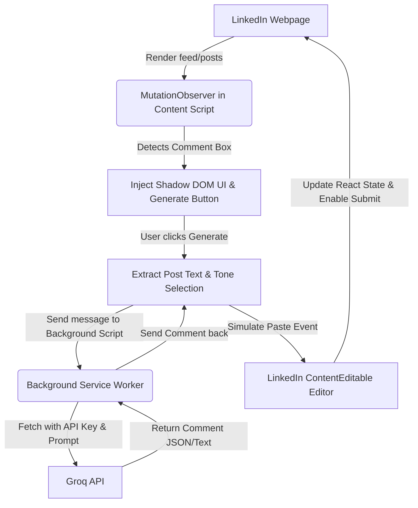

# AI-Powered LinkedIn Comment Generator Extension: Implementation Plan

This plan outlines the design and execution steps to build a Chrome Extension that automatically generates context-aware, premium LinkedIn comments using the Groq API. It includes technical details on navigating LinkedIn's dynamic DOM, bypassing React state constraints, optimizing LLM calls to prevent rate limits, and implementing anti-detection measures.

---

## 1. Extension Architecture Diagram



---

## 2. Core Modules & Directory Structure

We will create a lightweight Chrome Extension using standard Vanilla CSS/JS (MV3) to ensure ease of deployment and maximum speed.

```
linkedin-comments-ai/
├── manifest.json            # Extension configuration (Manifest V3)
├── popup/
│   ├── popup.html           # Beautiful, glassmorphic settings popup
│   ├── popup.css            # Styling for settings
│   └── popup.js             # Options handling (API Key, Tone selector, custom prompt)
├── background.js            # Background service worker (proxies API requests & manages rate limits)
├── content/
│   ├── content.js           # DOM manipulation, MutationObserver, injection, text extraction
│   └── content.css          # Injected stylesheet for extension elements (inside Shadow DOM)
├── icons/
│   ├── icon16.png
│   ├── icon48.png
│   └── icon128.png
└── README.md
```

---

## 3. Step-by-Step Execution Plan

### Step 1: Manifest V3 Configuration (`manifest.json`)
* Configure permissions:
  * `storage`: To store API keys, tone preferences, and cache locally.
  * `activeTab`: To read DOM details on the active LinkedIn tab.
  * Host permissions: Allow network access to Groq's endpoint (`https://api.groq.com/*`) from the background worker.
* Define `content_scripts` to load `content/content.js` and inject styling on `https://*.linkedin.com/*`.
* Define `background.service_worker` to run `background.js`.

### Step 2: Content Script & Dynamic DOM Injection (`content.js`)
* **Mutation Observer**: Watch for additions to the DOM. LinkedIn lazy-loads feed elements. When a post container (`div.feed-shared-update-v2` or elements with `data-urn`) is visible, detect its comment input container.
* **Comment Box Detection**: Look for active comment textboxes. The standard selector for the editor is a `contenteditable` container:
  * Selector: `div[role="textbox"][contenteditable="true"]` or `div[aria-label="Add a comment"]` inside `.feed-shared-update-v2`.
* **UI Overlay Injection**: 
  * Create a tiny container next to the text editor.
  * Using a **Shadow DOM** is critical here. It prevents LinkedIn’s global CSS styles from breaking our button style and shields our HTML from LinkedIn’s internal scripts.
  * The injected element will be a sleek, premium-looking button (e.g., a magic wand icon ✨) styled with CSS variables, hover micro-animations, and a loading spinner.
  * Add a dropdown or popup next to it for selecting comment tones (e.g. *Insightful*, *Constructive*, *Supportive*, *Funny*, *Questioning*).

### Step 3: Reliable LinkedIn Post Extraction
* When the user clicks the "Generate" button:
  1. Find the nearest ancestor post container from the clicked button.
  2. Search down this container for the main text body (usually within elements with classes matching `span.break-words` or descriptions).
  3. Extract and sanitize the text content (remove hashtags, strip extra whitespace, limit length to 1000 characters).

### Step 4: Groq API Integration & Rate-Limit Optimization
* The Content Script sends a message to the Background Script with the post text and selected tone.
* The Background Script retrieves the API Key from `chrome.storage.local`.
* **Rate-Limit Optimization Strategy**:
  1. **Token Pruning**: Truncate posts to the first 1000 characters. Large inputs waste tokens and hit rate limits.
  2. **Model Selection**: Use `llama-3.1-8b-instant` which is highly responsive and has a high RPM/TPM limit on Groq's free tier.
  3. **Optimized System Prompts**: Keep prompts short. Request plain-text output without conversational filler (e.g. "Here's a comment:" or double quotes) to keep output token count low.
  4. **Client-Side Caching**: Save generated comments in memory keyed by post ID. If the user accidentally clicks regenerate or toggles the comment box, return the cached version first.
  5. **Cool-down / Retry Header Handling**: If a `429 Too Many Requests` is received, parse the `retry-after` header and display a countdown to the user inside our Shadow DOM UI instead of failing silently.

### Step 5: Bypassing React / Draft.js Editor State
LinkedIn uses custom React rich editors (Draft.js). If you modify `innerHTML` or `textContent` directly, React will overwrite it. We bypass this via a synthetic Paste Event:
```javascript
function insertComment(editorElement, commentText) {
  editorElement.focus();
  
  // Clear any existing text safely using Range API selection + Delete
  const range = document.createRange();
  range.selectNodeContents(editorElement);
  const sel = window.getSelection();
  sel.removeAllRanges();
  sel.addRange(range);
  document.execCommand('delete', false, null);

  // Simulate Paste Event to trigger React's internal Draft.js listeners
  const dataTransfer = new DataTransfer();
  dataTransfer.setData('text/plain', commentText);
  const pasteEvent = new ClipboardEvent('paste', {
    clipboardData: dataTransfer,
    bubbles: true,
    cancelable: true
  });
  editorElement.dispatchEvent(pasteEvent);
}
```

### Step 6: Anti-Detection & Account Safety
To prevent LinkedIn from flagging the account:
1. **User-Initiated Action Only**: Never generate comments or scrape posts in the background. The extension only executes requests in response to a physical mouse click by the user on the "Generate" button.
2. **Natural Input Simulation**: The paste event mimics standard user clipboard operations, which are fully supported and common on social media.
3. **No Request Interception**: Do not touch LinkedIn's internal HTTP endpoints. Keep it strictly client-side DOM inspection.
4. **Rate Limit Injection**: Space out requests. Disable the "Generate" button for 5 seconds after a generation to prevent spamming clicks.

### Step 7: Options Page / Popup UI
* Create a premium options window.
* Inputs:
  * Groq API Key (stored securely in `chrome.storage.local` with password masking).
  * Custom Instructions (e.g. "I am a software engineer, write comments in that context", "Always write short, punchy 2-sentence comments").
  * Default tone selection.

---

## 4. Groq System Prompt for High-Quality LinkedIn Comments

We will implement prompt styling that enforces professional, engaging, and value-additive comments.

```
You are an expert LinkedIn commentator. Write a single engaging comment for the provided post text.
Tone: [USER_SELECTED_TONE]
Guidelines:
1. Be professional, value-adding, and relevant. Avoid generic filler like "Great post!" or "Thanks for sharing."
2. Write between 1 to 3 sentences. Keep it punchy and easy to read.
3. Do not include hashtags or emojis unless they are highly contextual.
4. Output ONLY the raw comment text. Do not use quotes, intro sentences, or explanations.
[CUSTOM_USER_INSTRUCTIONS]
Post Content:
[POST_CONTENT]
```

---

## 5. Timeline & Iteration Phases

1. **Phase 1: Setup & Manifest (1 hour)**
   * Create folders, initialize `manifest.json`, check permissions, write basic background script.
2. **Phase 2: DOM Injection & CSS Styling (2 hours)**
   * Set up `MutationObserver` on LinkedIn.
   * Build the Shadow DOM UI element wrapper with a premium "✨ Generate" button.
3. **Phase 3: React / Editor Autofill Bridge (1.5 hours)**
   * Implement and test the Paste simulation to ensure Draft.js recognizes the input and enables the LinkedIn "Post" button.
4. **Phase 4: LLM Integration & Configuration (2 hours)**
   * Write the popup interface to save API keys in Chrome storage.
   * Code the background fetch requests to Groq, including retry handlers and token limiting.
5. **Phase 5: Polishing & Anti-Detection Testing (1.5 hours)**
   * Refine Shadow DOM CSS to blend in with LinkedIn’s dark/light modes.
   * Implement input debouncing and cache.
